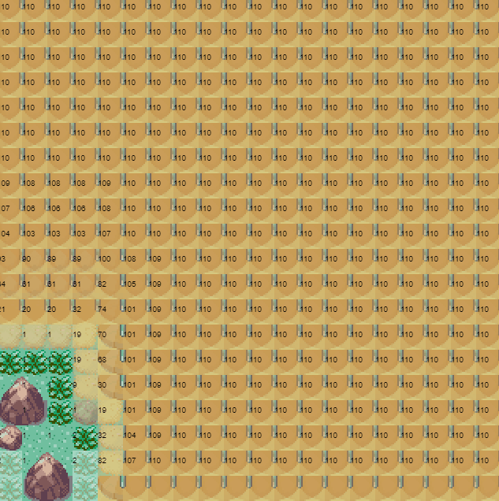
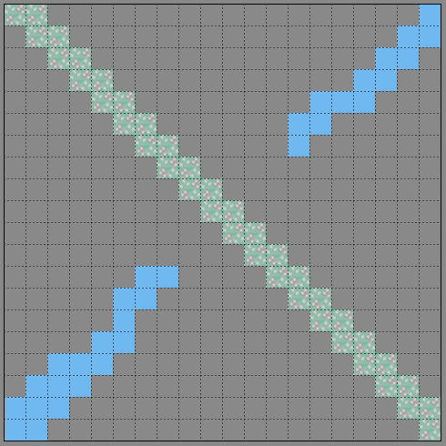
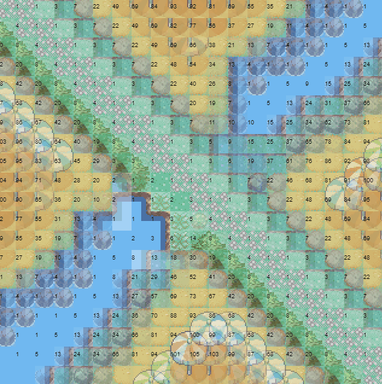

# Wave function collapse inspired map generator.
Given a layout to start with, and a set of rules for generation. this generator attempts to fill the map with tiles.

There is a rule generator which analyses adjacencies from an input 'tiled map editor' json map

You can load a 'tiled map editor' json map with empty space for the generator to fill in

## Basic example (no extra inputs)

## Predefined water crossing layout

## filling out the water crossing

## Changelog
### V2
- Optimized
- Read about how WFC is supposed to work and improved the consistency of tiles resolving
- Seperated the rule generator so that it outputs a rules file 
### V1
- Added rule generator which can take an map layout as input and generate a set of rules.
- Added Tiled map editor importing.

## Todo
Lots to refactor, clean usage examples, speed it up more